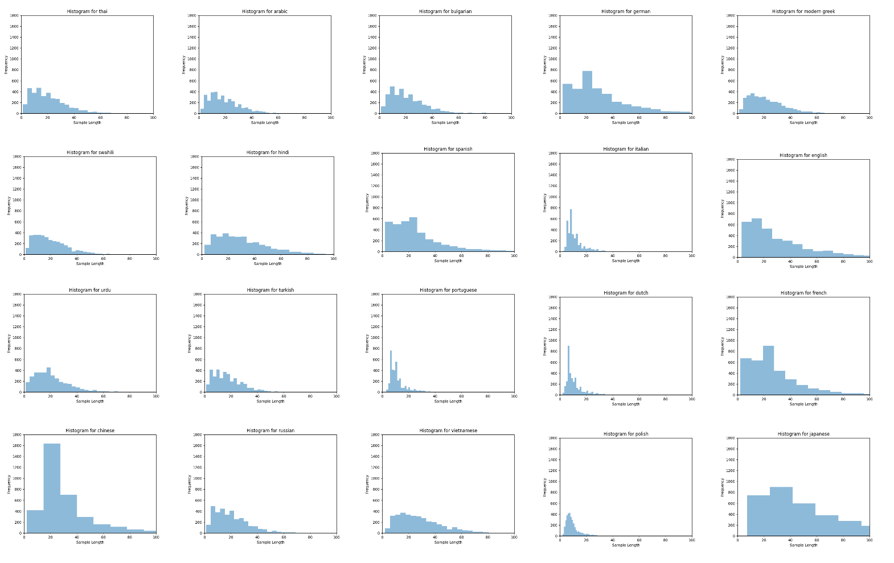
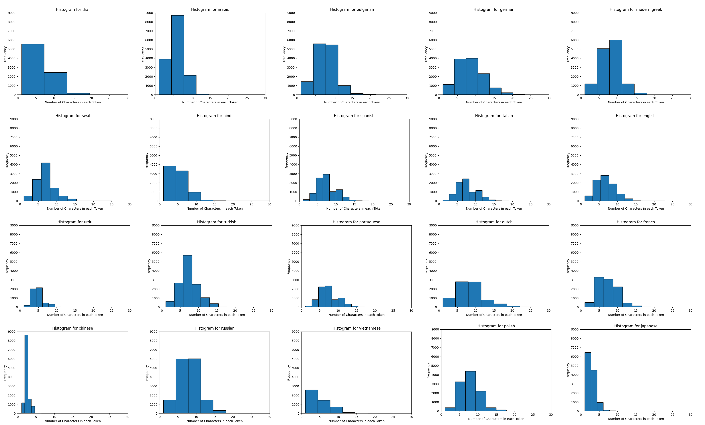

# Language Identification Challenge

## 1. Introduction
Language identification, a fundamental task in Natural Language Processing (NLP), refers to the process of automatically determining the language of a given piece of text. In a world characterized by multilingual diversity, language identification plays a crucial role in a wide range of applications, from language-specific processing to information retrieval, sentiment analysis, and machine translation.

This repository aims to provide a reliable and easy-to-use language identification tool based on state-of-the-art NLP techniques. Our project enables developers, researchers, and language enthusiasts to seamlessly integrate language identification into their applications.

## 2. Dataset Preparations
The dataset utilized in this repository is available in the [huggingface dataset repository](https://huggingface.co/datasets/papluca/language-identification). 

This dataset provides 90k samples consisting of text passages and corresponding language label. This dataset was created by collecting data from 3 sources: Multilingual [Amazon Reviews Corpus](https://huggingface.co/datasets/amazon_reviews_multi), [XNLI](https://huggingface.co/datasets/xnli), and [STSb Multi MT](https://huggingface.co/datasets/stsb_multi_mt). This dataset contains text in 20 languages, which are:

arabic (ar), bulgarian (bg), german (de), modern greek (el), english (en), spanish (es), french (fr), hindi (hi), italian (it), japanese (ja), dutch (nl), polish (pl), portuguese (pt), russian (ru), swahili (sw), thai (th), turkish (tr), urdu (ur), vietnamese (vi), and chinese (zh)

## 3. Data Analysis
### 3.1 Sample Length Analysis
In this section, a comprehensive analysis of sample lengths is presented for each class.

<b style='text-align:center;'>Figure 1: Sample length analysis for each class. </b>

### 3.2 Token Length Analysis
In this section, a comprehensive analysis of token lengths is presented for each class.

<b style='text-align:center;'>Figure 2: Token length analysis for each class. </b>