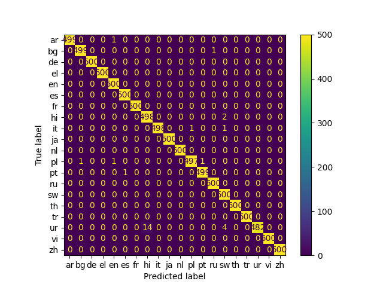

# Language Identification Challenge

## 1. Introduction

Language identification, a fundamental task in Natural Language Processing (NLP), refers to the
process of automatically determining the language of a given piece of text. In a world characterized
by multilingual diversity, language identification plays a crucial role in a wide range of
applications, from language-specific processing to information retrieval, sentiment analysis, and
machine translation.

This repository aims to provide a reliable and easy-to-use language identification tool based on
state-of-the-art NLP techniques. Our project enables developers, researchers, and language
enthusiasts to seamlessly integrate language identification into their applications.

## 2. Dataset Preparations

The dataset utilized in this repository is available in
the [huggingface dataset repository](https://huggingface.co/datasets/papluca/language-identification)
.

This dataset provides 90k samples consisting of text passages and corresponding language label. This
dataset was created by collecting data from 3 sources:
Multilingual [Amazon Reviews Corpus](https://huggingface.co/datasets/amazon_reviews_multi)
, [XNLI](https://huggingface.co/datasets/xnli),
and [STSb Multi MT](https://huggingface.co/datasets/stsb_multi_mt). This dataset contains text in 20
languages, which are:

arabic (ar), bulgarian (bg), german (de), modern greek (el), english (en), spanish (es), french (fr)
, hindi (hi), italian (it), japanese (ja), dutch (nl), polish (pl), portuguese (pt), russian (ru),
swahili (sw), thai (th), turkish (tr), urdu (ur), vietnamese (vi), and chinese (zh)

## 3. Data Analysis

### 3.1 Sample Length Analysis

In this section, we conduct a thorough analysis of sample lengths for each class in the dataset.
Based on our examination, we have determined that setting the maximum sentence length to 50 yields
optimal results. This decision ensures preserving essential context and information within the
passages.


<b style='text-align:center;'>Figure 1: Sample length analysis for each class. </b>

### 3.2 Token Length Analysis

In this section, we provide an analysis of token lengths for each class in the dataset. It is
evident from the results that the token length, which represents the number of characters in each
token, exhibits a distinct distribution across the various classes. These variations in token
lengths are crucial to consider, as they may influence the choice of appropriate models and
techniques for language identification.


<b style='text-align:center;'>Figure 2: Token length analysis for each class. </b>

## 4. Proposed Model
In this section, we present our proposed model, which uses various features for language identification. The input to our language model consists of three different components:
    
1. Sentence at the token level.
2. Sentence at the character level. 
3. Token length for each token represented as a sequence of strings.

To effectively capture these features, we utilize the powerful Mt5-base model for feature extraction at the token level. Additionally, we employ token length for each token as a valuable feature for language identification. Our data analysis suggests that token length variations in different languages can serve as meaningful indicators for this task.

For character-level input, we use an embedding lookup. To extract n-gram features from the character input, we employ a CNN module with 64 filters and window sizes of 3, 5, and 7.

The process involves extracting features from both the Mt5-base model and the character-level CNN module. We then combine the final distributions over classes obtained from the softmax layer after each feature extraction moduel (MT5 and CNN). This combined distribution is utilized in the final softmax layer, which ultimately classifies each sentence. Figure 3 shows our proposed model.


<b style='text-align:center;'>Figure 3: Our proposed model for language identification task. </b>

## 5. Results

### 5.1 Metrics

For the language identification task, we employ <b>accuracy</b> and <b>macro F1-score</b> as our
primary evaluation metrics to analyze the performance of all models. Accuracy measures the overall
correctness of the model's predictions, reflecting the proportion of correctly classified instances
out of the total. On the other hand, macro F1-score considers both precision and recall for each
class and then calculates the unweighted average across all classes.

### 5.2 Pre-Processing
During the pre-processing step, we apply several normalizations to the text. Firstly, we convert all characters in the sentences to lowercase. Next, we remove all digits from the text. After that, we proceed to eliminate emojis and all punctuation marks from the sentences.


### 5.3 Baseline Models

First, we examine the result
of [Gaussian Naive Bayes](https://scikit-learn.org/stable/modules/generated/sklearn.naive_bayes.GaussianNB.html)
and [Support Vector Machine](https://scikit-learn.org/stable/modules/generated/sklearn.svm.SVC.html)
on this
dataset. [CountVectorizer](https://scikit-learn.org/stable/modules/generated/sklearn.feature_extraction.text.CountVectorizer.html)
and [TfidfVectorizer](https://scikit-learn.org/stable/modules/generated/sklearn.feature_extraction.text.TfidfVectorizer.html)
are used to convert text into features. Initially, we evaluate the performance of two popular
machine learning algorithms, Gaussian Naive Bayes and Support Vector Machine (SVM), on the language
identification dataset. To prepare the textual data for these models, we use two common feature
extraction techniques: CountVectorizer and TfidfVectorizer. The CountVectorizer converts the text
into a matrix of token counts, while the TfidfVectorizer transforms it into a matrix of term
frequency-inverse document frequency (TF-IDF) features.

<table style='text-align:center;'>
  <tr>
    <td> <b>Models</b> </td>
    <td colspan="4"><b>CountVectorizer</b></td>
    <td colspan="4"><b>TfidfVectorizer</b></td>
  </tr>
  <tr>
    <td></td>
    <td colspan="2"><b>Accuracy</b></td>
    <td colspan="2"><b>Macro F1-Score</b></td>
    <td colspan="2"><b>Accuracy</b></td>
    <td colspan="2"><b>Macro F1-Score</b></td>
  </tr>
  <tr>
    <td>  </td>
    <td colspan="1"> Dev </td>
    <td colspan="1"> Test </td>
    <td colspan="1"> Dev </td>
    <td colspan="1"> Test </td>  
    <td colspan="1"> Dev </td>
    <td colspan="1"> Test </td>
    <td colspan="1"> Dev </td>
    <td colspan="1"> Test </td>  
  </tr>
  <tr>
  <td>Gaussian Naive Bayes</td>
    <td colspan="1"> 92.43 </td>
    <td colspan="1"> 92.22 </td>
    <td colspan="1"> 92.08 </td>
    <td colspan="1"> 91.78 </td>
    <td colspan="1"> 92.13 </td>
    <td colspan="1"> 92.17 </td>
    <td colspan="1"> 91.78 </td>
    <td colspan="1"> 91.74 </td>
  </tr>
  <tr>
    <td>Support Vector Machine</td>
    <td colspan="1"> 87.30 </td>
    <td colspan="1"> 87.24 </td>
    <td colspan="1"> 88.12 </td>
    <td colspan="1"> 88.11 </td>
    <td colspan="1"> 86.59 </td>
    <td colspan="1"> 87.63 </td>
    <td colspan="1"> 86.46 </td>
    <td colspan="1"> 87.54 </td>
</table>

<b style='text-align:center;'>Table 1: Analysis of Machine Learning Classifiers as Baseline
Models</b>

Based on the results presented in Table 1, the Gaussian Naive Bayes model with CountVectorizer as
the feature extraction method demonstrates the most promising performance on both the dev and test
datasets. As a result, we consider this model as our baseline for future experiments.

**Note**: `ml_classifier.py` script conduct machine learning analysis.

### 5.4 Experimental Evaluations

#### 5.4.1 Language Model Analysis

In the initial step, we conduct a language identification task by evaluating two multilingual
language models: XLM-RoBERTa-Base and MT5-base. For this analysis, we extract the first token,
maximum value, and mean value of the last layer's output from these language models. These extracted
features are then used as the final representation for each sample. Subsequently, we employ a
softmax classifier to classify each sample based on these extracted features.

As shown in Table 2, MT5-Base with the mean value and first token of the last layer's output
demonstrates superior performance, achieving the promising result for both accuracy and Macro
F1-score on both the test and development data.
<table style='text-align:center;'>
  <tr>
    <td> <b>Models</b> </td>
    <td colspan="4"><b>Accuracy</b></td>
    <td colspan="4"><b>Macro F1-Score</b></td>
  </tr>
  <tr>
    <td>  </td>
    <td colspan="2"> Dev </td>
    <td colspan="2"> Test </td>
    <td colspan="2"> Dev </td>
    <td colspan="2"> Test </td>
  </tr>
  <tr>
  <td>Baseline</td>
    <td colspan="2"> 92.43 </td>
    <td colspan="2"> 92.22 </td>
    <td colspan="2"> 92.08 </td>
    <td colspan="2"> 91.78 </td>
  </tr>
  <tr>
  <td>XLM-RoBERTa-Base (First Token)</td>
    <td colspan="2"> 99.73 </td>
    <td colspan="2"> <b>99.73</b> </td>
    <td colspan="2"> 99.65 </td>
    <td colspan="2"> 99.64 </td>
  </tr>
  <tr>
  <td>XLM-RoBERTa-Base (Max)</td>
    <td colspan="2"> 98.04 </td>
    <td colspan="2"> 98.12 </td>
    <td colspan="2"> 97.87 </td>
    <td colspan="2"> 97.98 </td>
  </tr>
  <tr>
  <td>XLM-RoBERTa-Base (Mean)</td>
    <td colspan="2"> 99.54 </td>
    <td colspan="2"> 99.57 </td>
    <td colspan="2"> 99.41 </td>
    <td colspan="2"> 99.47 </td>
  </tr>

  <tr>
  <td>MT5-Base (First Token)</td>
    <td colspan="2"> 99.73 </td>
    <td colspan="2"> <b>99.73</b> </td>
    <td colspan="2"> 99.70 </td>
    <td colspan="2"> <b>99.67</b> </td>
  </tr>
  <tr>
  <td>MT5-Base (Max)</td>
    <td colspan="2"> 98.29 </td>
    <td colspan="2"> 98.24 </td>
    <td colspan="2"> 98.14 </td>
    <td colspan="2"> 98.04 </td>
  </tr>
  <tr>
  <td>MT5-Base (Mean)</td>
    <td colspan="2"> <b>99.75</b> </td>
    <td colspan="2"> <b>99.73</b> </td>
    <td colspan="2"> <b>99.71</b> </td>
    <td colspan="2"> 99.65 </td>
  </tr>

</table>

<b style='text-align:center;'>Table 2: Analysis of XLM-RoBERTa-Base and MT5-Base with different
pooling methods.</b>

#### 5.4.2 Using Character-Based Features

In this section, we explore the utilization of two character-based features: sentence representation at the character level and token length for each token. As depicted in Table 3, these features contribute slightly to the model's performance improvement. Consequently, we conclude that multilingual language models such as XLM-RoBERTa and MT5 can perfectly extract the necessary features for the language identification task, making additional features redundant.
<table style='text-align:center;'>
  <tr>
    <td> <b>Models</b> </td>
    <td colspan="4"><b>Accuracy</b></td>
    <td colspan="4"><b>Macro F1-Score</b></td>
  </tr>
  <tr>
    <td>  </td>
    <td colspan="2"> Dev </td>
    <td colspan="2"> Test </td>
    <td colspan="2"> Dev </td>
    <td colspan="2"> Test </td>
  </tr>
  <tr>
  <td>MT5-Base (First Token) + Character Embedding</td>
    <td colspan="2"> <b>99.76</b> </td>
    <td colspan="2"> 99.70 </td>
    <td colspan="2"> <b>99.72</b> </td>
    <td colspan="2"> 99.63 </td>
  </tr>
  <tr>
  <td>MT5-Base (Mean) + Character Embedding</td>
    <td colspan="2"> 99.73 </td>
    <td colspan="2"> <b>99.73</b> </td>
    <td colspan="2"> 99.67 </td>
    <td colspan="2"> 99.65 </td>
  </tr>

  <tr>
  <td>MT5-Base (First Token) + Token Length </td>
    <td colspan="2"> 99.73 </td>
    <td colspan="2"> <b>99.73</b> </td>
    <td colspan="2"> 99.69 </td>
    <td colspan="2">  <b>99.67</b> </td>
  </tr>
  <tr>
  <td>MT5-Base (Mean) + Token Length </td>
    <td colspan="2"> 99.73 </td>
    <td colspan="2"> 99.70 </td>
    <td colspan="2"> 99.69 </td>
    <td colspan="2"> 99.65 </td>
  </tr>

  <tr>
  <td>MT5-Base (First Token) + Character Embedding +Token Length </td>
    <td colspan="2"> 99.72 </td>
    <td colspan="2"> <b>99.73</b> </td>
    <td colspan="2"> 99.66 </td>
    <td colspan="2"> 99.65 </td>
  </tr>
  <tr>
  <td><b>MT5-Base (Mean) + Character Embedding +Token Length (proposed model)</b>> </td>
    <td colspan="2"> <b>99.76</b> </td>
    <td colspan="2"> 99.72 </td>
    <td colspan="2"> <b>99.72</b> </td>
    <td colspan="2"> 99.64 </td>
  </tr>

</table>

<b style='text-align:center;'>Table 3: Analysis of using character-base features with MT5-base.</b>

#### 5.4.3 Classification Result in Different Languages
In this section, we analyze the classification result in different languages. Table 4 presents the precision, recall, and F1 score for each class, using the <b>MT5-Base (Mean) + Character Embedding + Token Length</b> model by using test data. Figure 4 Also shows the confusion matrix for model prediction with test data.  
<table style='text-align:center;'>
  <tr>
    <td> <b>Language</b> </td>
    <td colspan="2"><b>Precision</b></td>
    <td colspan="2"><b>Recall</b></td>
    <td colspan="2"><b>Macro F1-Score</b></td>
    <td colspan="2"><b>Num Sentence</b></td>
  </tr>
  <tr>
  <td>Arabic</td>
    <td colspan="2"> 100.00 </td>
    <td colspan="2"> 99.80 </td>
    <td colspan="2"> 99.90 </td>
    <td colspan="2"> 500 </td>
  </tr>
  <tr>
  <td>Bulgarian</td>
    <td colspan="2"> 99.80 </td>
    <td colspan="2"> 99.80 </td>
    <td colspan="2"> 99.80   </td>
    <td colspan="2"> 500 </td>
  </tr>  
  <tr>
  <td>German</td>
    <td colspan="2"> 100.00 </td>
    <td colspan="2"> 100.00 </td>
    <td colspan="2"> 100.00 </td>
    <td colspan="2"> 500 </td>
  </tr> 
  <tr>
  <td>Modern greek</td>
    <td colspan="2"> 100.00 </td>
    <td colspan="2"> 100.00 </td>
    <td colspan="2"> 100.00 </td>
    <td colspan="2"> 500 </td>
  </tr>
  <tr>
  <td>English</td>
    <td colspan="2"> 99.60 </td>
    <td colspan="2"> 100.00 </td>
    <td colspan="2"> 99.80 </td>
    <td colspan="2"> 500 </td>
  </tr>
  <tr>
  <td>Spanish</td>
    <td colspan="2"> 99.80 </td>
    <td colspan="2"> 100.00 </td>
    <td colspan="2"> 99.90 </td>
    <td colspan="2"> 500 </td>
  </tr>
  <tr>
  <td>French</td>
    <td colspan="2"> 100.00 </td>
    <td colspan="2"> 100.00 </td>
    <td colspan="2"> 100.00 </td>
    <td colspan="2"> 500 </td>
   </tr>
   <td>Hindi</td>
    <td colspan="2"> 97.27 </td>
    <td colspan="2"> 99.60 </td>
    <td colspan="2"> 98.42 </td>
    <td colspan="2"> 500 </td>
  <tr>
  <td>Italian</td>
    <td colspan="2"> 100.00 </td>
    <td colspan="2"> 99.60 </td>
    <td colspan="2"> 99.80 </td>
    <td colspan="2"> 500 </td>
  </tr>
  <tr>
  <td>Japanese</td>
    <td colspan="2"> 100.00 </td>
    <td colspan="2"> 100.00 </td>
    <td colspan="2"> 100.00 </td>
    <td colspan="2"> 500 </td>
  </tr>
  <tr>
  <td>Dutch</td>
    <td colspan="2"> 100.00 </td>
    <td colspan="2"> 100.00 </td>
    <td colspan="2"> 100.00 </td>
    <td colspan="2"> 500 </td>
  </tr>
  <tr>
  <td>Polish</td>
    <td colspan="2"> 99.80 </td>
    <td colspan="2"> 99.40 </td>
    <td colspan="2"> 99.60 </td>
    <td colspan="2"> 500 </td>
  </tr>
  <tr>
  <td>Portuguese</td>
    <td colspan="2"> 99.80 </td>
    <td colspan="2"> 99.80 </td>
    <td colspan="2"> 99.80 </td>
    <td colspan="2"> 500 </td>
  </tr>
  <tr>
  <td>Russian</td>
    <td colspan="2"> 99.80 </td>
    <td colspan="2"> 100.00 </td>
    <td colspan="2"> 99.90 </td>
    <td colspan="2"> 500 </td>
  </tr>
  <tr>
  <td>Swahili</td>
    <td colspan="2"> 98.62 </td>
    <td colspan="2"> 100.00 </td>
    <td colspan="2"> 99.30 </td>
    <td colspan="2"> 500 </td>
  </tr>
  <tr>
  <td>Thai</td>
    <td colspan="2"> 100.00 </td>
    <td colspan="2"> 100.00 </td>
    <td colspan="2"> 100.00 </td>
    <td colspan="2"> 500 </td>
  </tr>
  <tr>
  <td>Turkish</td>
    <td colspan="2"> 100.00 </td>
    <td colspan="2"> 100.00 </td>
    <td colspan="2"> 100.00 </td>
    <td colspan="2"> 500 </td>
  </tr>
  <tr>
  <td>Urdu</td>
    <td colspan="2"> 100.00 </td>
    <td colspan="2"> 96.40 </td>
    <td colspan="2"> 99.90 </td>
    <td colspan="2"> 500 </td>
  </tr>
  <tr>
  <td>Vietnamese</td>
    <td colspan="2"> 100.00 </td>
    <td colspan="2"> 100.00 </td>
    <td colspan="2"> 100.00 </td>
    <td colspan="2"> 500 </td>
  </tr>
  <tr>
  <td>Chinese</td>
    <td colspan="2"> 100.00 </td>
    <td colspan="2"> 100.00 </td>
    <td colspan="2"> 100.00 </td>
    <td colspan="2"> 500 </td>
  </tr>
</table>
<b style='text-align:center;'>Table 4: Classification analysis in different languages.</b>



<b style='text-align:center;'>Figure 4: Confusion matrix for model prediction with test data. </b>


#### 5.4.4 Sentence Representation Analysis
In this section, we analyze the sentence representations learned by the <b>MT5-Base (Mean) + Character Embedding + Token Length</b> model by using test data before and after training. As observed, prior to training, samples in each class may exhibit slight similarities in their representations, owing to the presence of same tokens in each language. However, after training, the sentence representations for each class become distinctly separable. The model successfully achieves well-defined and separable representations for each class. Figure 5 shows sentence representation before training and Figure 6 shows sentence representation after training.


<b style='text-align:center;'>Figure 5: Sentence representation before training. </b>


<b style='text-align:center;'>Figure 6: Sentence representation after training. </b>


## 6. Project Structure
```
├─ assets                         <- Model artifacts directory
│   ├─ plots                      <- Iamges
│   ├─ saved_models               <- Saved models
│   ├─ char2idx.json              <- Character to index file
│   ├─ idx2char.json              <- Index to character file
│   ├─ index2label.json           <- Index to label to index file
│   ├─ label2index.json           <- Label to index file
│  
├─ data                           <- Project data
│   ├─ Processed                  <- Normalized data
│   ├─ Raw                        <- Raw data  
│
├─ Language_Identification        <- Source code
│  │
│  ├─ configurations              <- Config package
│  │  ├── __init__.py
│  │  ├── configurations.py       <- Models configurations, data and model paths
│  │
│  ├─ data_loader                 <- Data loader package
│  │  ├── __init__.py
│  │  ├── data_reader.py          <- Read data scripts
│  │  ├── data_writer.py          <- Write data scripts
│  │
│  ├─ data_preparation            <- Data preparation package
│  │  ├── __init__.py
│  │  ├── indexer.py              <- Indexer scripts
│  │  ├── normalizer.py           <- Text normalization scripts
│  │  ├── token_indexer.py        <- Token Indexer scripts
│  │
│  ├─ dataset                     <- Dataset package
│  │  ├── __init__.py
│  │  ├── data_module.py          <- Data module scripts
│  │  ├── dataset.py              <-  Dataset scripts
│  │
│  ├─ inference                   <- Inference package
│  │  ├── __init__.py
│  │  ├── inference.py            <- Inference scripts
│  │
│  ├─ models                      <- Models package
│  │  ├── __init__.py
│  │  ├── lm_model.py             <- Language model scripts
│  │  ├── pooling_model.py        <-  Pooling methods scripts
│  │
│  ├─ utils                       <- Utility package
│  │  ├── __init__.py
│  │  ├── constant.py             <- constants
│  │  ├── helper.py               <-  helper scripts
│  │  ├── InputExample.py         <-  Input example scripts
│  │  ├── lightening_trainer.py   <-  Lightening trainer scripts
│  │
│  │
│  ├── __init__.py
│  ├── data_analyzer.py           <-  Data analyzer scripts
│  ├── evaluation.py              <- Evaluation scripts
│  └── inferencer.py              <- Inferencer scripts
│  └── ml_classifier.py           <- Machine learning trainer scripts
│  └── trainer.py                 <- Deep learning model trainer scripts
├── .gitignore                    <- List of files ignored by git
├── .README.md
├── requirements.txt              <- File for installing python dependencies
```

## Requirements
* Python3
* Packages in requirements.txt

## ToDo
 + Add docstring for all functions.
 + Add more ablation study on different configurations of our proposed model.
 + Add unit test for functions.


